# Hello-Spring !

<[스프링 입문 - 코드로 배우는 스프링 부트, 웹 MVC, DB 접근 기술](https://www.inflearn.com/course/%EC%8A%A4%ED%94%84%EB%A7%81-%EC%9E%85%EB%AC%B8-%EC%8A%A4%ED%94%84%EB%A7%81%EB%B6%80%ED%8A%B8/dashboard)>

Inflearn 강의를 보며 스프링에 입문해 공부하면서 진행한, 회원관리 예제 프로젝트 입니다.

모든 내용과 그림 자료들은 수업 자료에서 근거하였습니다.

<br/>

### 새로 배운 InteliJ 단축키

* ctrl + alt + b : 찾아가기
* ctrl + alt + v : 반환값 받아오기
* soutv : result 문자열을 출력하는 형식의 print문
* ctrl + p : 매개변수 정보 확인
* alt + enter : 컨텍스트 작업 표시
* shift + F6 : 같은 단어 동시에 모두 수정
* ctrl + alt + shift + t : 리팩토링 관련 메뉴
* ctrl + alt + m : 드래그 영역 메소드로 뽑기
* ctrl + shift + t  : 새로운 테스트 코드 생성
* shift + F10 : 가장 최근 수행한 파일 실행
* ctrl + alt + n : 불필요한 코드 한줄로 변환

<br/>

<br/>

### 어노테이션

#### @SpringBootApplication

* 스프링이 실행되기 위한 파일이라는 의미의 어노테이션.
* Main 메소드가 들어있는 코드, 어플리케이션을 나타낸다.

#### @Component

* 컴포넌트 스캐닝을 통해 자동으로 스프링 빈에 등록하기 위해서 사용하는 어노테이션이다.
* Controller, Service, Repository 등의 내부에도 들어가있다.

#### @Controller

* spring container에, 해당 객체를 생성해서 스프링에 넣어두고, 관리하기 위한 어노테이션이다.
* Controller를 통해서 외부 요청을 받아 처리한다.

#### @Service

* spring이 올라올 때, 해당 객체를 spring container에 등록해 관리하기 위한 어노테이션이다.
* Service를 통해서 비스니스 로직을 만들어 수행한다.

#### @Repository

* 마찬가지로 해당 객체를 spring container에 등록해 관리하기 위한 어노테이션이다.
* Repository를 통해서 데이터를 저장한다.

#### @Autowired

* 생성자에 붙여 spring container의 객체와 연결시키기 위한 어노테이션이다.
* spring container에, 자동으로 컨트롤러를 등록하면서 필드로 존재하는 객체의 생성자도 호출한다.
* 그러면 앞서 service로 등록해 spring container 안에 존재하는 객체를 가져다가 연결시켜준다.
* 생성자가 하나일 경우, 해당 어노테이션을 생략할 수 있다고 한다!

#### @Bean

* 자바 코드로 스프링 빈을 직접 등록하기 위해 생성자 위에 써주는 어노테이션이다.
* 해당 어노테이션이 있는 클래스에 대해 객체를 만들어 스프링 빈으로 등록해주는 것.
* 그러나 Controller의 경우 자바 코드로 직접 등록하지 않고, 컴포넌트 스캔을 이용한다.

#### @Test

* junit에 속한 것으로, 테스트 하는 메소드라는 의미로 붙여주는 어노테이션이다.

#### @AfterEach

* 각 테스트 메소드가 수행된 후마다 호출되는 메소드라는 의미로 붙여주는 어노테이션이다.

#### @BeforeEach

* 각 테스트 메소드가 수행되기 전에 매번 호출하는 메소드라는 의미로 붙여주는 어노테이션이다.

#### @Entity

* JPA가 관리하는 Entity가 된다는 의미로 붙여주는 어노테이션이다.

#### @Id

* Primary Key로 설정한다는 의미의 어노테이션이다.

#### @GeneratedValue(strategy = GenerationType.IDENTITY)

* Identity : DB가 알아서 ID를 생성해주는 전략 

<br/>

<br/>

### 내부 구동 방법

* Controller
* Repository
* Member
* Service

<br/>

#### 동작 환경

* 웹 브라우저가 요청을 하면, 스프링 컨테이너에서는 우선적으로 컨트롤러를 찾는다.
* 컨트롤러에서 리턴 값으로 문자를 반환하면 viewResolver가 화면을 찾아 처리한다.
  * 스프링 부트 템플릿엔진 기본 viewName 매핑
  * resources:templates/ + {ViewName} + .html

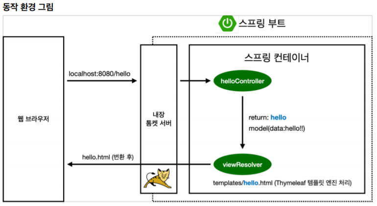

<br/>

#### 정적 컨텐츠 이미지

* 웹 브라우저가  요청을 하면 우선적으로 컨트롤러를 찾는다.
* 하지만 만약 매칭되는 컨트롤러가 없으면 바로 요청한 html 페이지를 반환한다.
* 이 html 페이지는 정적 컨텐츠이며, 기본 경로로 **/static** 또는 **/public**, **/resources** 등을 우선적으로 찾는다.
* [스프링 부트 정적 컨텐츠 기능](https://docs.spring.io/spring-boot/docs/2.3.1.RELEASE/reference/html/spring-boot-features.html#boot-features-spring-mvc-static-content) - spring.io reference

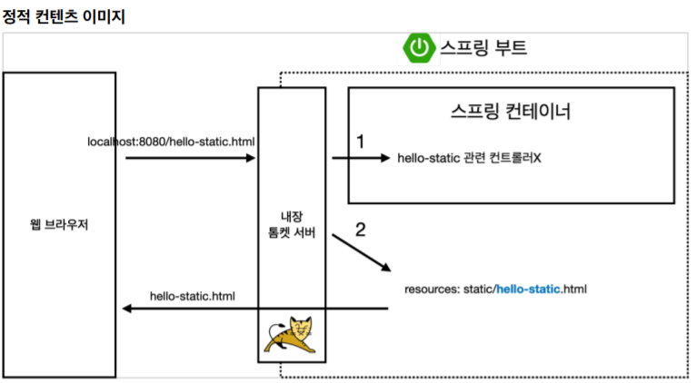

<br/>

#### MVC, 템플릿 엔진

* Controller라는 어노테이션이 있으면, 스프링이 뜰 때 객체를 생성해서 관리한다.
* 이를 Bean을 관리한다고 표현하는데, 콩 처럼 생겨서...
* 앞서 말했듯, 이 컨트롤러를 가장 우선적으로 찾아서 이를 통해 기능들을 수행하는 것이다.
* 컨트롤러는 뷰 리졸버를 찾아 요청을 전달한다.
* 템플릿 엔진을 이용하기 때문에, viewResolver가 해당 요청 파일을 **/templates** 경로에서 찾아 반환한다.


<br/>

#### @ResponseBody

* @ResponseBody 를 사용하면 뷰 리졸버(viewResolver)를 사용하지 않는다.
* 대신에 HttpMessageConverter 가 동작한다.
  * HTTP의 BODY에 문자 내용을 직접 반환한다. (HTML BODY TAG를 말하는 것이 아님)
    * "\<HTML> .. " 등 html 태그를 모두 문자열로 반환해서 html 형식으로 출력할 수도 있지만, 굳이..
    * 반환하는 내용이 객체이면 **Json** 형식으로, 문자열이면 **String** 형식으로 컨버터를 호출해 처리한다.
  * 기본 **문자**처리 : **String**HttpMessageConverter
  * 기본 객체처리: Mapping**Jackson**2HttpMessageConverter
  * byte 처리 등등 기타 여러 HttpMessageConverter가 기본으로 등록되어 있음

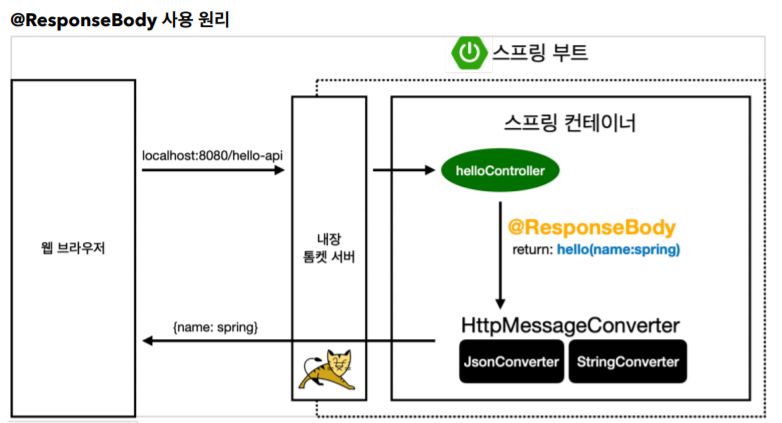

<br/>

<br/>

### Test case 작성

* 개발한 기능을 테스트 해볼 때 사용한다.
* main메소드나 controller 등을 통해 실행하는 방법은 오래걸리고, 반복 실행이 어렵다.
* 따라서 자바에서 JUnit 이라는 프레임 워크를 통해 테스트를 실행해 문제를 해결한다.
* 테스트 코드에서는 메소드 이름을 한글로 적어도 된다!!

<br/>

#### 사용 방법

* 테스트 하려는 파일과 **같은 패키지 경로**, **같은 클래스 이름+Test**를 만드는 것이 관례이다.
* 테스트 메소드 위에 @Test 어노테이션을 써준다.

<br/>

#### 더 편한 Test 방법!!

* 테스트 하려는 클래스의 이름에 가서 ctrl + shift + t 를 눌러 Create New Test 를 해주면 껍데기를 만들어준다.

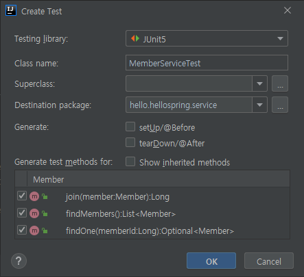

<br/>

#### Given / when / then 패턴

* given
  * 이 데이터를 기반으로 하는구나!
  * 검증할 데이터에 대해 주어지는 부분
* when
  * 이걸 검증하는구나!
  * 뭘 검증할 것인지를 작성하는 부분
* then
  * 여기가 검증부 구나!

<br/>

#### import org.junit.jupiter.api.Assertions;

* Assertions.assertEquals(expected, actual);
  * 테스트 케이스로 두 번째 인자가 첫 인자값과 같은지 비교하기 위해 사용하는 방법 중 하나.

<br/>

#### import org.assertj.core.api.Assertions;

* Assertions.assertThat(expected).isEqualTo(actual);
  * 마찬가지로 뒤의 인자가 앞선 인자와 같은지 비교하기 위해 사용하는 방법
  * Static으로 import 하여 Assertions 없이 바로 assertThat 을 사용할 수 있다.

<br/>

#### try-catch

* 예외 처리에 대한 상황을 처리하기 위해 try-catch를 사용하기도 한다.
* 하지만 그보다 더 좋은 문법을 제공한다.  

<br/>

#### assertThrows

* assertThrows(IllegalStateException.class, () -> memberService.join(member2))
  * 해당 객체의 메소드를 실행했을 때 발생하는 예외를 반환한다.
  * 반환한 값을 예외클래스 객체 e로 받아, getMessage()가 같은지 비교하는 형식으로도 쓸 수 있다.
  * 

<br/>

#### 주의할 점

* 테스트는 순서가 보장되지 않기 때문에, 서로 의존관계 없이 독립적으로 테스트 되도록 설계되어야 한다!!
* 그러기 위해선 각 테스트가 종료될 때마다 저장소나 공용 데이터를 지워주어야 문제가 발생하지 않는다.
  * @AfterEach 어노테이션을 붙여주면, 각 메소드가 수행된 후마다 callback 함수처럼 호출된다.
  * 해당 클래스에 객체.clear() 라는 저장소를 비우는 기능을 수행하는 메소드를 만들어 호출한다.
* 테스트는 잘 작동되는지 확인하는 것도 중요하지만, 예외 상황을 잘 처리하는지 테스트도 중요하다.

<br/>

<br/>

#### 테스트 주도 개발, TDD

* TDD : Test-driven development

* 테스트를 먼저 만들고 구현 클래스를 만들어서 돌려보는 방식을 말한다.
* [참고 블로그](https://medium.com/@jang.wangsu/tdd-tdd%EC%9D%98-%EC%9E%A5%EB%8B%A8%EC%A0%90%EC%97%90-%EB%8C%80%ED%95%B4-%EC%83%9D%EA%B0%81%ED%95%B4%EB%B3%B4%EA%B8%B0-dcf32a72b098)

<br/>

<br/>

### 서비스

* 서비스는 비즈니스 의존적으로 단어 등을 사용하며 설계하고,

* 리포지토리는 단순히 기계적으로, 개발스럽게 단어를 선택한다.

<br/>

<br/>

### Dependency Injection, 의존성 주입

* 회원 controller가 회원 service와 회원 repository를 사용할 수 있게 의존 관계를 추가한다.
* 생성자에 @Autowired가 있으면 스프링이 연관된 객체를 스프링 컨테이너에서 찾아 넣어준다.
* 이렇게 객체의 의존관계를 외부에서 넣어주는 것을 의존성 주입이라고 한다.

<br/>

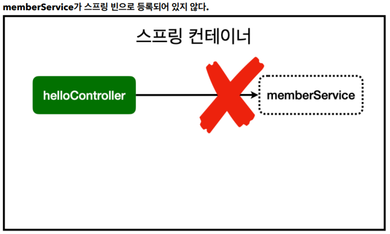

* 하지만 @Autowired만 해주면 등록된 스프링 빈을 찾을 수 없다는 에러가 뜰 것이다.
* 이를 위해 스프링 빈으로 등록해주어야 한다.

<br/>

#### DI의 3가지 방법

* 생성자 주입
  * 의존관계가 실행 중 동적으로 변하는 경우는 없기 때문에 이 방법을 권장한다.
* 필드 주입
  * 중간에 값을 변경할 방법이 없어 별로 권장하지 않는다.
* setter 주입
  * setter 메소드가 public으로 열려 있어야 하고, 중간에 바꿀 수 없다.
  * 누구나 호출할 수 있는 메소드이기에, 별로 권장하지 않는다.

<br/>

<br/>

### 스프링 빈을 등록하는 2가지 방법

<br/>

#### 컴포넌트 스캔과 자동 의존관계 설정

* **@Component** 어노테이션이 있는 것은 전부 객체를 만들어서 **스프링 빈으로 자동으로 등록**한다.
  * 다음 어노테이션들도 내부에 @Component 를 포함하는 어노테이션이다.
  * **컴포넌트 스캔** 때문에 자동으로 스프링 빈으로 등록되는 것이다.
    * @Controller
    * @Service
    * @Repository

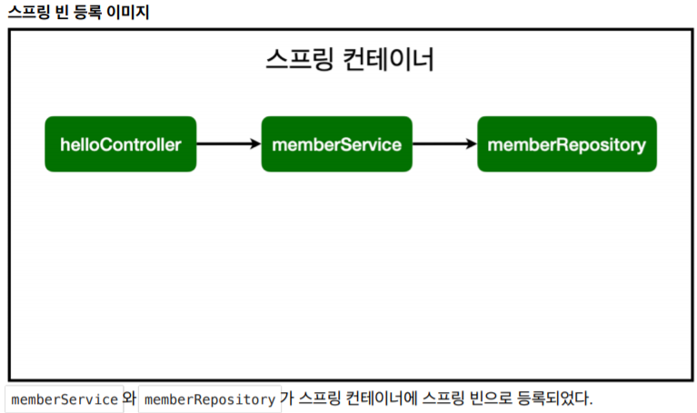

* 그리고 @Autowired는 해당 연관 관계 즉, 선을 그어주는 녀석이라고 생각하면 된다.
* **단! @SpringBootApplication이 존재하는 패키지의 하위 경로에만 자동 등록이 가능하다.**
* **그리고, 기본적으로 싱글톤으로 등록한다. 따라서 같은 스프링 빈이면 같은 인스턴스다.**
* 수정할 때 건드려줘야 할 코드들이 여러 개 있다.

<br/>

#### 자바 코드로 직접 스프링 빈 등록하기

* 컴포넌트 스캔으로 자동 등록하는 방법이 아니라, 직접 등록하는 방법이다.
* SpringConfig라는 자바 파일을 만든다.
* @Bean 어노테이션을 생성자에 붙여서 스프링 빈으로 등록해준다.
* 생성자의 반환값으로 객체를 반환하도록 하는데, 이 때 의존성을 가지는 다른 객체를 인자로 넣어줄 수 있다.
* Config 파일을 만들어 @Bean으로 직접 등록하면, 다른 코드 영향 없이 구현 클래스를 손쉽게 교체할 수 있다.

<br/>

#### TIP!

* **컴포넌트 스캔을 사용하는 경우**

  * 실무에서는 주로 정형화된 컨트롤러, 서비스, 리포지토리 같은 코드는 컴포넌트 스캔을 사용한다.

* **직접 자바코드로 스프링 빈을 등록하는 경우**

  * 정형화 되지 않거나, 상황에 따라 구현 클래스를 변경해야 하면 설정을 통해 스프링 빈으로 등록한다

  * 위 예제의 경우에 해당하는데,  DB가 선택되지 않아서 나중에 교체하려는 시나리오로 진행한다.

* **스프링 빈에 등록하지 않은 객체의 경우**

  * **@Autowired 를 통한 DI는, 스프링이 관리하는 객체에서만 동작한다.**
  * 스프링 빈으로 등록하지 않고 내가 직접 생성한 객체에서는 동작하지 않는다.

<br/>

<br/>

### HTTP 전달 방법

#### Get 방식 메소드

* URL에 직접 치는 방식
* 주로 조회할 때 쓴다.

#### Post 방식 메소드

* 주로 데이터를 등록할 때 쓴다.
* 여기도 간단히 다시 정리하자!

<br/>

<br/>

### 스프링 DB 접근기술

<br/>

#### H2 데이터베이스

* 교육용 데이터베이스로 설치부터 사용까지 간단하고 가볍다.

<br/>

#### 순수 Jdbc

* 정신 건강을 위해 흐름만 파악하고 넘어가자.
* 예전에는 이렇게 복잡한 방법으로 하나하나 코딩했다고 한다.

```java
implementation 'org.springframework.boot:spring-boot-starter-jdbc'
runtimeOnly 'com.h2database:h2'
```

* 먼저 build.gradle 파일에 db관련 라이브러리를 추가해준다.
* 간단한 쿼리로 데이터를 받는 간단한 예제인데도 Jdbc를 사용하는 코드들이 메소드마다 매우 복잡했다.
* 하드코딩...
* 그냥 맛보기로 **이런 식으로 코딩한다**에 대한 맛보기만.

```java
@Override
public Member save(Member member) {
    String sql = "insert into member(name) values(?)";
    Connection conn = null;
    PreparedStatement pstmt = null;
    ResultSet rs = null;
    try {
        conn = getConnection();
        pstmt = conn.prepareStatement(sql,
                                      Statement.RETURN_GENERATED_KEYS);
        pstmt.setString(1, member.getName());
        pstmt.executeUpdate();
        rs = pstmt.getGeneratedKeys();
        if (rs.next()) {
            member.setId(rs.getLong(1));
        } else {
            throw new SQLException("id 조회 실패");
        }
        return member;
    } catch (Exception e) {
        throw new IllegalStateException(e);
    } finally {
        close(conn, pstmt, rs);
    }
}
```

<br/>

#### 리포지토리 변경

* 아무튼 코드는 복붙했고, 이렇거나 저렇거나 jdbc를 사용해서 db에 접근하는 방식으로 일단 만들었다.
* 기존의 메모리 repository에서 H2 DB의 repository로 '교체' 했다.
* 의존 관계는 다음과 같다.

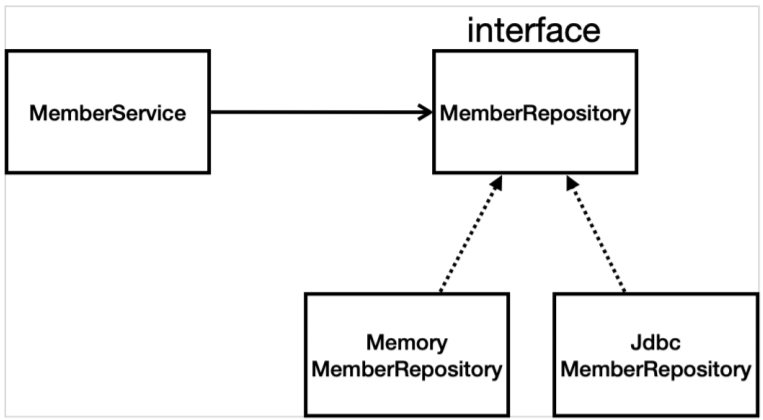

* 인터페이스를 만들어 메모리 리포지토리 구현체와, Jdbc 리포지토리 구현체를 구현한다.

<br/>

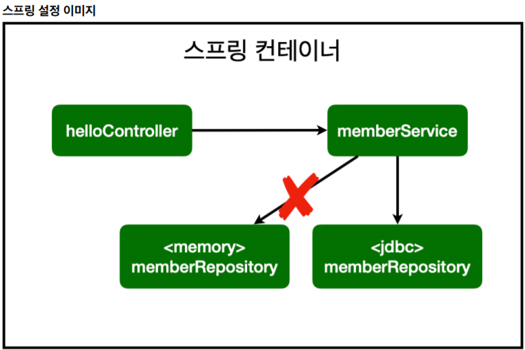

* **개방-폐쇄 원칙** (OCP, Open-Closed Principle)
  * 확장에는 열려있고, 수정, 변경에는 닫혀있다.
  * 객체지향의 다형성 개념을 활용하는 기법.
* 여기서 스프링의 장점이 나오는데, 처음에는 메모리에 저장하는 메모리 리포지토리를 연결했었다.
* 이 때, **기존 코드는 손대지 않고, 스프링 빈 등록이나 의존 관계를 관리하는 Config 파일만 수정해주면 된다.**
* 이렇게 스프링의 **DI** (Dependencies Injection)를 사용하면 기존 코드를 전혀 손대지 않고, 설정만으로 구현 클래스를 변경할 수 있다.
  * 내가 해준 것은 스프링 빈에 등록하는 @Bean 어노테이션 코드만 작성했고, 의존성 주입은 스프링이 알아서 매핑하여 해주는 것이다.

<br/>

### 스프링 통합 테스트

* 앞서 했던 테스트들은 사실, 순수 Java code 만 가지고 했던 테스트일 뿐 스프링과는 관련 없었다.
* 이제는 스프링과 연관시켜서 DB도 다 활용한 테스트를 진행한다! 이름하여 스프링 통합테스트.
* 테스트 할 때는 그냥 필요한 것들을 injection 해서 사용하고 끝이니까, 편한 방법을 쓰는게 좋다.
* 주로 필드 기반으로 @Autowired를 사용해서 스프링이 알아서 연결해주도록 하는 방법도 많이 쓴다.

<br/>

#### @SpringBootTest

* 스프링 부트 테스트를 위한 어노테이션. 한 줄이면 끝난다.
* 스프링 컨테이너와 테스트를 함께 실행한다.
* 진짜 스프링을 띄우는 것과 같이 동작.

#### @Transactional

* 이 어노테이션이 있으면, 테스트 시작 전에 트랜잭션을 시작하고, 완료 후에는 항상 Rollback한다.
* 이렇게 하면 테스트 코드로 인해 생성되는 데이터가 실제 DB에 영향을 주지 않는다.
* 즉, 각 메소드마다 트랜잭션을 시작하고 - 테스트 하고 - 롤백하고 반복한다.

<br/>

### 스프링 JdbcTemplete

* 순수 Jdbc와 동일한 환경설정을 하면 된다.
* 스프링 JdbcTemplate과 **MyBatis** 같은 라이브러리는 JDBC API에서 본 **반복 코드를 대부분 제거**해준다. 
* 하지만 SQL은 직접 작성해야 한다.

* JdbcTemplate은 injection을 받을 수 없어서, Data source를 받아서 넣어준다.
* 그리고 생성자가 딱 하나만 있으면, 스프링 빈으로 등록될 때 @Autowired를 생략할 수 있다.

<br/>

#### Templete Method Pattern

* 나중에 찾아보고 공부해보자. 디자인 패턴

<br/>

### JPA

* Java Persistence API : DB 관리를 표현하는 자바 API이다. (표준 인터페이스)
  * 객체와 ORM이라는 기술
    * Object Relational Mapping
  * 그 중 여기서는 구현체로 제공되는 hibernate 라이브러리를 사용하게 된다.
* JPA는 기존의 반복 코드는 물론이고, 기본적인 SQL도 JPA가 직접 만들어서 실행해준다.
* JPA를 사용하면, SQL과 데이터 중심의 설계에서 객체 중심의 설계로 패러다임을 전환을 할 수 있다.
* JPA를 사용하면 개발 생산성을 크게 높일 수 있다.

<br/>

#### 사용 방법

* 먼저 build.gradle 파일에 다음을 추가한다.

```java
implementation 'org.springframework.boot:spring-boot-starter-data-jpa'
```

* application properties 파일에도 다음을 추가한다.

```properties
spring.jpa.show-sql=true
spring.jpa.hibernate.ddl-auto=none
```

* auto = create로 변경하면 객체를 보고 테이블까지도 알아서 다 만들어준다.

<br/>

#### EntityManager

* JPA는 Entity Manager 라는 것으로 모든게 동작한다.
* 앞서 properties랑 gradle 파일에서 선언해 준 정보들이랑, Database Connection 정보들을 알아서 잘 모아서 스프링 부트가 Entity Manager라는 것을 만들어준다.
* 즉, 해당 객체 내부에 DataResource 정보를 다 가지고 있어서 내부적으로 DB와 통신을 다 처리를 한다.
* **결론적으로, JPA를 쓰려면 Entity Manager를 스프링으로부터 주입 받아야 한다.**

<br/>

<br/>

#### 스프링 데이터 JPA

<br/>

<br/>

<br/>

<br/>

<br/>

## Error Issue!

<br/>

### java.lang.NoClassDefFoundError:

Error:gradle-resources-test:hello-spring.main: java.lang.NoClassDefFoundError: org/apache/tools/ant/util/ReaderInputStream

* 해결 방법을 못찾았다...
* 캐시도 지우고 리빌드, 재시작, 재부팅, 여러가지로 해봤지만 해결을 못했다...
* 결국 새 프로젝트를 만들어서 기존의 코드를 다 옮기는 것으로 해결했다.

<br/>

#### 테스트 코드에 한글 가능, But 깨짐 현상

* 콘솔에 출력되는 부분은 한글이 문제없이 잘 나왔다.
* 하지만 인텔리제이 프로그램 자체에서 표시하는 한글이 깨지는 문제가 발생했다.
* 분명 테스트 케이스에서 메소드 이름으로 한글을 사용 한다고 했는데..
* 인코딩 문제인가 싶어 UTF-8로 전부 바꾸고 적용했지만 해결이 안되더라.

<br/>

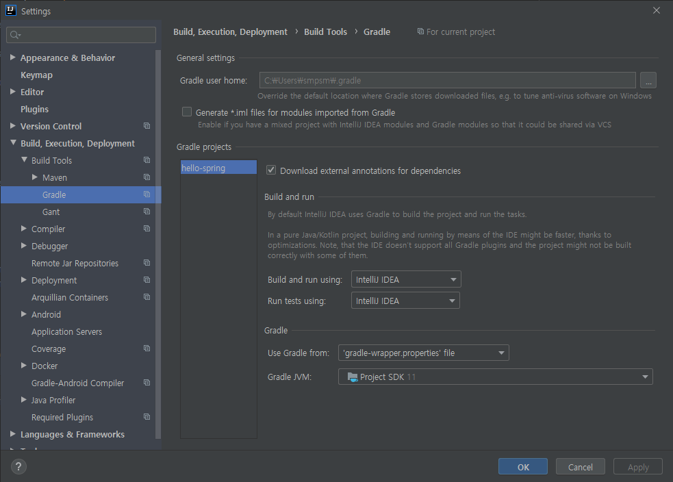

* 나중에 알고보니, 테스트 실행하는 것이 Gradle로 설정되어 있어서 그랬던 것 같다.
* 설정에서 Gradle의 Build and run using과 Run tests using 부분을 intelliJ로 변경하니 해결되었다.
* 실행 또한 속도면에서도 IDE로 설정해놓는 것을 권장한다고 한다.

<br/>

### JdbcSQLInvalidAuthorizationSpecException: 

#### Wrong user name or password

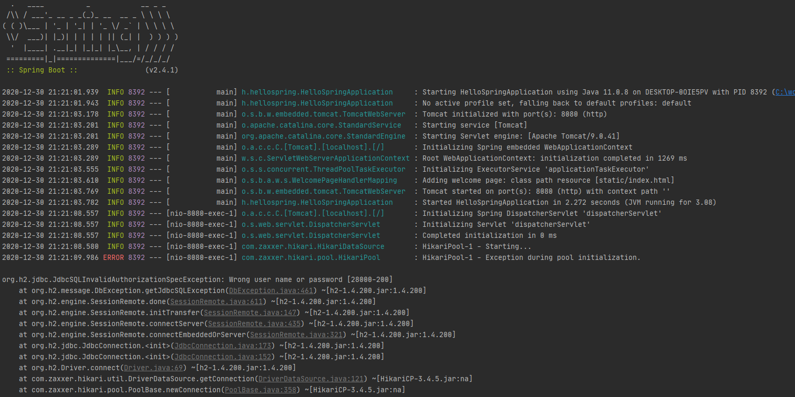

* 지금 상황은, 기존의 메모리 리포지토리에서 새로 만든 H2 DB로 교체하는 작업을 수행한 상태이다.
* 이 때, 기존에 저장된 회원 목록을 조회하는 기능을 수행하는 도중 에러가 발생한다.
* 강의에서 하시는 그대로 토씨하나 틀리지 않고 똑같이 잘 했는데 어째서 에러가 나는 것일까.
* IDE는 친절하다. 차근차근. 에러 코드를 확인해보자.

<br/>

```
JdbcSQLInvalidAuthorizationSpecException: Wrong user name or password
```

* user 이름이나 비밀번호가 틀렸다고 한다.
* 해당 에러에 대해 검색해보니, [스프링 부트 2.4 에서는 DB 커넥션 오류 해결을 위해 패치](https://www.inflearn.com/questions/94189)가 되었단다.
* 그래서 반드시 properties 파일에 **"spring.datasource.username=sa"** 를 써주어야 한다고 한다.

<br/>

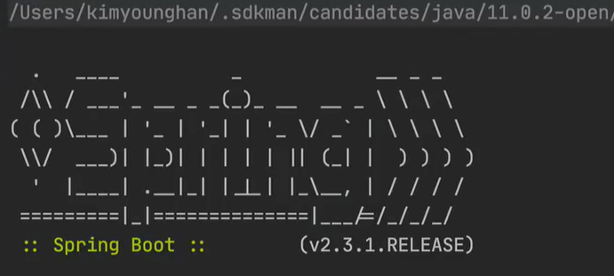

* 혹시 몰라 강사님의 화면을 멈춰 확인해보니... 그러네. 2.3.1 버전이었다. 내꺼는 2.4.1 버전.
* 다행히 금방 해결된 오류였다.

<br/>

### JUnit 테스트는 항상 트랜잭션을 롤백한다.

#### @Rollback(false)

* 오류..까지는 아니고, 테스트를 할 때 연결 된 DB에 join 하는 기능을 수행했지만 DB에 남는 데이터가 없었다.
* 찾아보니, 기본적으로 '테스트' 이기 때문에 기능 수행 후에 Default로 Rollback을 하는 것 같았다.

* 이를 방지하기 위해 @Rollback 어노테이션에 인자를 (false)로 주면 수행한 결과 그대로 반영했다.
* 반대로 기본값이 true 일테니, 어노테이션을 쓰지 않으면 롤백을 수행하는 듯 하다.

...

* 아. @Transactional 이라는 어노테이션을 붙여주면 기본적으로 rollback을 해준다.

<br/>